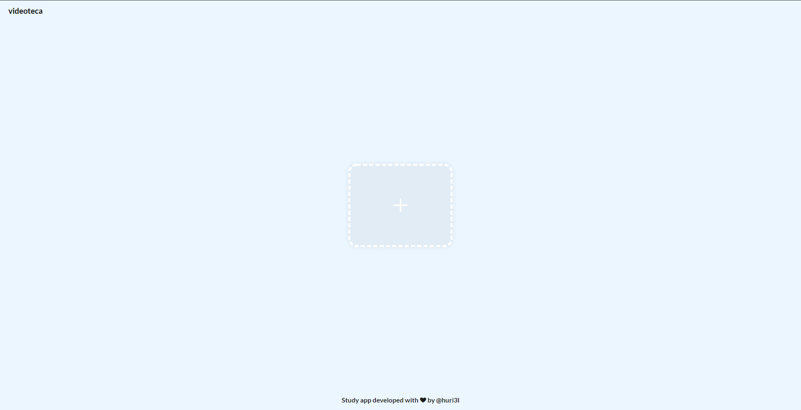
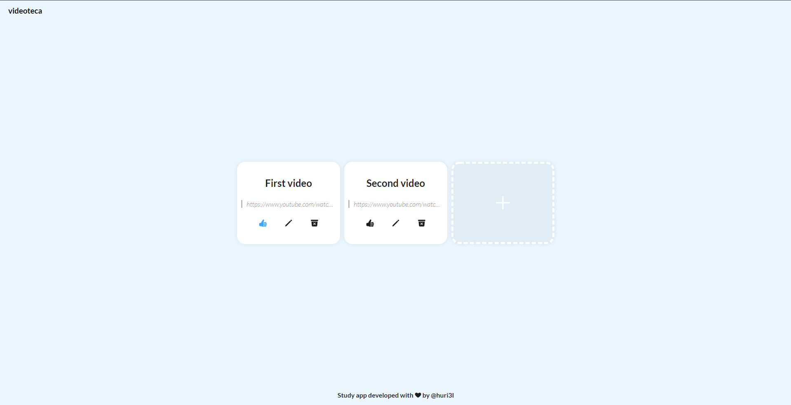
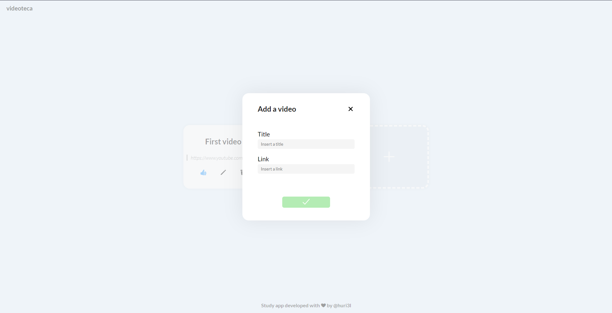
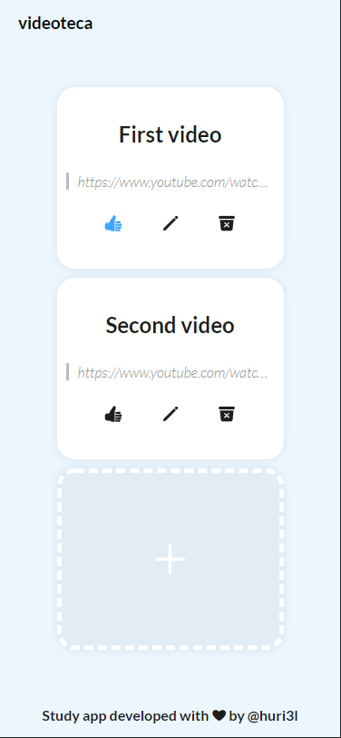

# Videoteca
Aplicação de estudo desenvolvida para aprender tecnologias e fixar conceitos da web.

### Tecnologias utilizadas:
* MongoDB
* Node.js
  * Express
  * uuid
  * Mongoose
* React
  * React Icons
  * Axios
  * SWR

### Novos aprendizados:
#### Node.js:
Em Node.js, pude aprender a criar um **API Rest** utilizando conceitos básicos de desenvolvimento de uma aplicação, como:
* Criação de um CRUD em Node.js;
* A separação de responsabilidades através de arquivos e funções de acordo com os padrões utilizados pela comunidade;
* Roteamento com o **Express**;
* Utilizar **Insomnia** para desenvolver o backend sem um frontend estruturado; 
* **Métodos HTTP**
* Liberação de uso do backend para o **CORS**.

#### React:
Aqui obtive vários conhecimentos novos, como:
* Como consumir uma API utilizando o Axios;
* Criação e utilização de hooks personalizados no React para melhor aproveitamento de código;
* Separação das regras de negócio para serem gerenciadas por contextos;
* O uso de SWR para melhorar ainda mais a User Experience;
* O conceito de UI otimista e o mutate de SWR;
* Um pouco mais sobre design responsivo e CSS.

### Sobre o app
É um aplicativo para você salvar links de vídeos, onde pode colar o link de um vídeo, atribuí-lo um nome, dar like, editar e excluir. O código e a UI foi feita inteiramente em inglês, buscando melhorar meu conhecimento na linguagem.

**Homepage:**

**Homepage com notas:**

**Modal para criar/editar nota**

**E sim, funciona em dispositivos móveis!**

